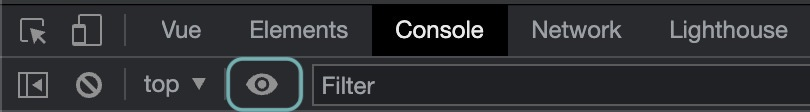
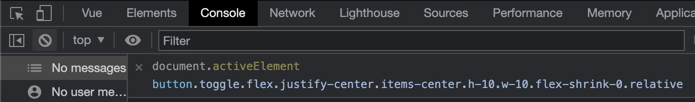

Lately, I've been focusing more and more on accessibility. The past few weeks I attended [Manuel Matuzović's](https://twitter.com/mmatuzo) accessibility testing workshop hosted by Smashing Magazine. I learned a lot of gems in that workshop, but the Active Element Live Expression stands out as one of the simplest and most helpful.

_Note: As far as I'm aware, this only works in Chromium browsers._

I didn't even know that you could add Live Expressions to the Console. Live Expressions run every time something changes in the browsers, and checking the active element (what is focused) is perfect for this!

## Set Up

1. Open the console (`cmd + option + j` on a mac)
2. Click on the eye icon

3. Add `document.activeElement` in the expression field

## That's all there is to it

Now every time your focus updates, this field will tell you what element has the current focus. This trick is a winner. Give it a try.
