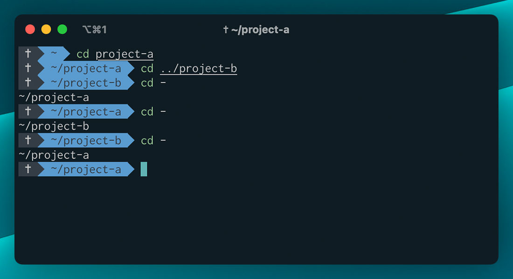
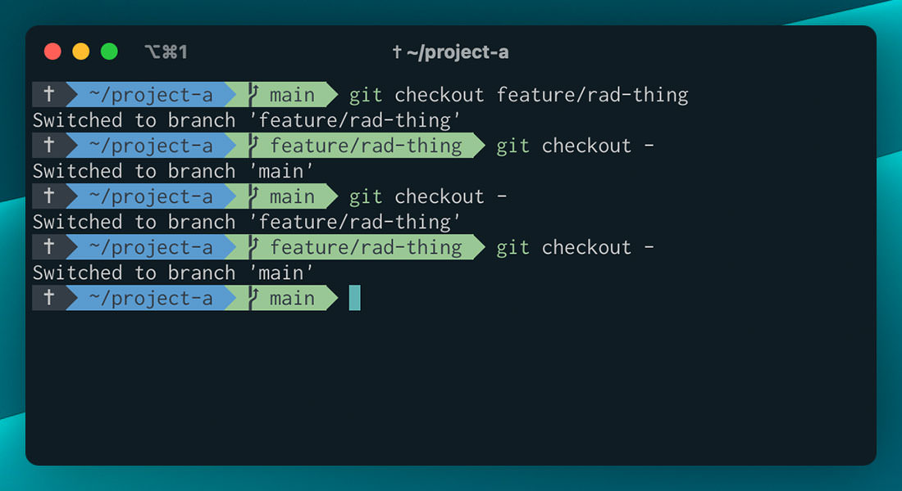

Being a front-end dev, I have some kind of relationship with the terminal. Sometimes, I have a desire to learn more and be a hacker, but most of the time what I know gets me by. That said, sometimes I find something that is so simple that it instantly becomes a part of my workflow.

That happened again today when [Josh Comeau](https://twitter.com/joshwcomeau) shared his post: [The Front-End Developer's Guide to the Terminal](https://www.joshwcomeau.com/javascript/terminal-for-js-devs/). Like any good front-end dev, I ~~read the article~~ read all of Josh's articles. I don't know if I expected to pick anything up or just confirm I knew what I needed to know, but I didn't expect to grab this little nugget.

## Previous Shortcut
So I'm in the terminal minding my own business in `project-a`, and I need to look at something in `project-b`, so I run `cd ../project-b`. Now I'm `project-b` and I need to get back to `project-a`. This time I run `cd ../project-a`. I could keep doing this or, I could use the previous working directory shortcut (no idea what it's actually called) like this `cd -`. This will take me back to the previous working directory. When I leave one directory for another, the one I left becomes the previous working directory. So, this gives you a type of toggle back and forth between directories.

## It works in git, too!

This is where things get really spicy, you can use this to toggle between git branches! It's helpful to be able to swap between directories, but usually, I just have a terminal session up for both. Branches, on the other hand, I go back and forth all day. So, how does it work?

If you're in the `main` branch and you want to check out a `feature/rad-thing` then you'd run `git checkout feature/rad-thing`. Now that you're in `feature/rad-thing`, `main` is your previous branch. This means you can just run `git checkout -` to get back to `main`. If you have aliases set up for git then you can probably just run `gco -`. I am so pumped about this.

Thank you, Josh Comeau. You never disappoint.
