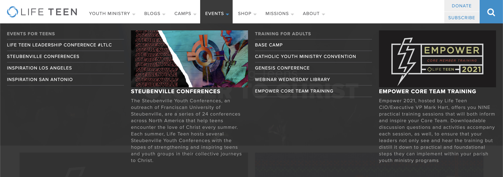
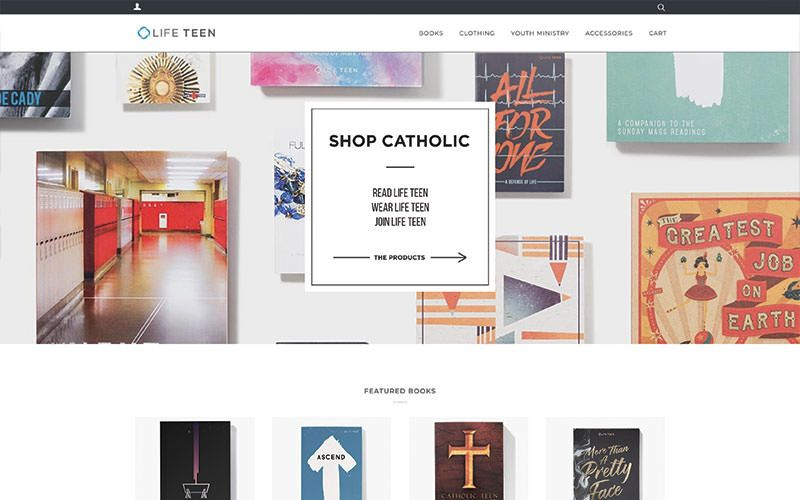

The [Life Teen](https://lifeteen.com) was rebuilt in April of 2015 for Life Teen's 30th anniversary. At the time, the website got an average of 30,000 hits a day, but I'm sure it's more now. The CEO wanted to make sure that our site was constantly changing, so I came up with ad blocks on the homepage giving us the opportunity to trade out content on a regular basis while featuring our events, resources, and products.

One of the biggest challenges with this site was the navigation. With so many different types of users and content, we needed a solution that would work for everything. We worked on a lot of iterations and landed on a mega menu that would allow the user quick access to whatever they might be looking for.

I worked on the Life Teen website and other web apps for four years. It's hard to put everything into one post. While most of the content has changed, the bones are there for everything I was a part of, like the [Life Teen Online Store](https://shop.lifeteen.com).

## My Contributions:
I was one of the key contributors to the rebrand that happened for the 30th anniversary. I designed and developed [lifeteen.com](https://lifeteen.com). I prototyped the designs with Invision to present to the rest of the company. The site is built on WordPress using ACF, Foundation, and Sass.
