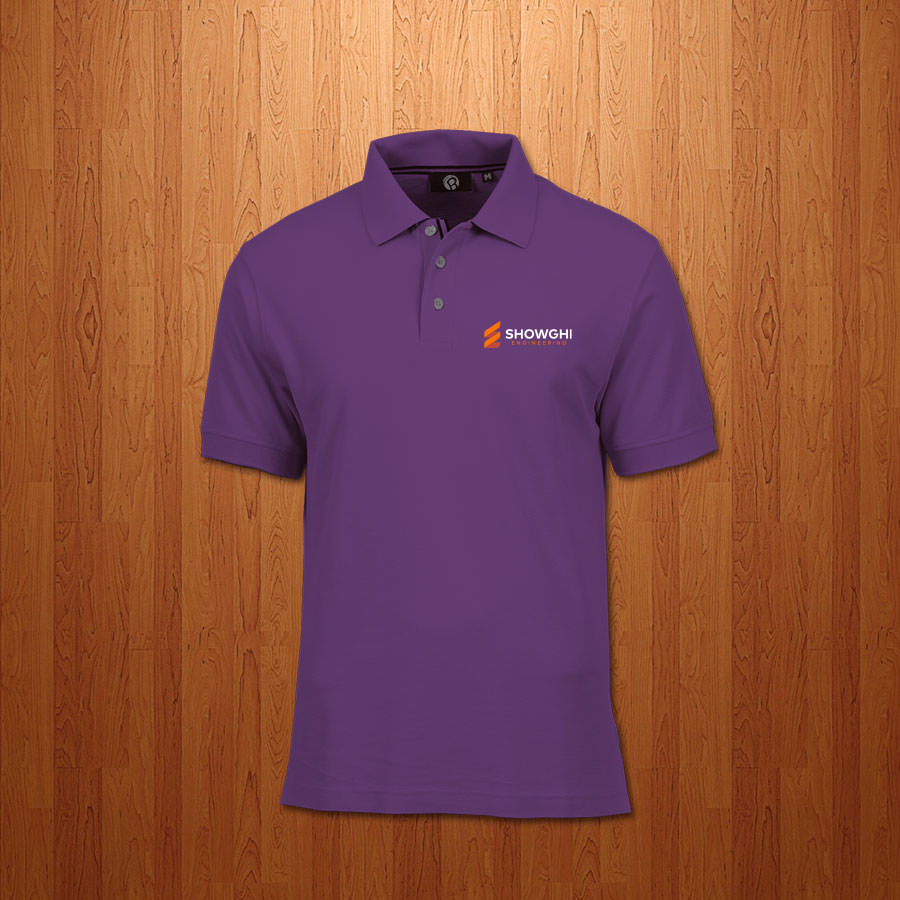

Maybe the best way to get me to do some work for you is to ask me to help you choose based on options I don't like. That was the case with [Showghi Engineering](https://showghi.com). My friend, Justin, is the founder, and he reached out to ask for logo advice while choosing from a 99designs competition.

I don't think all of their designs were bad, but none of those designers were able to have a conversation with Justin to understand his desires and needs. After talking with him for a bit, I convinced him to give me a chance to come up with a logo for him.

## The Brand
We wanted to keep the mark simple, the font clean, and give the overall logo a timeless feel. There are several key elements in the logo. First, the mark makes both an `S` and an `E`. Second, the goal was to point up to show forward progress and growth. The mark also represents threads on a screw or bolt to give a nod to engineering. The type was set with a geometric san serif. Finally, Justin wanted to use orange because of his love of Clemson University.

After Justin approved the branding, I worked through a simple color/style guide and provided some apparel mock-ups – of course, I went with Clemson colors.

#goTigers
