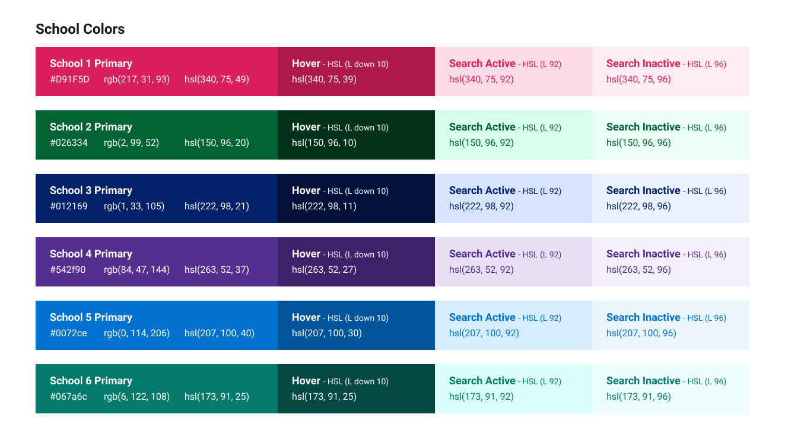
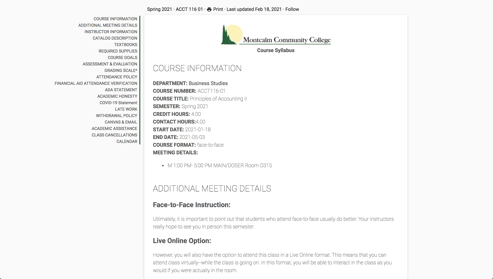
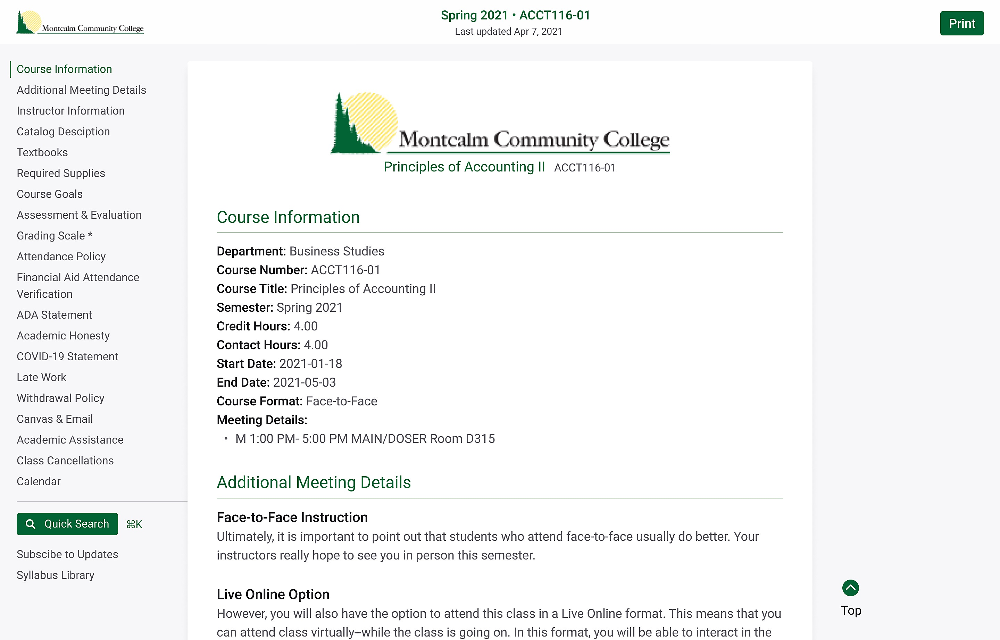

I partnered with a company called Simple Syllabus to rework one of the main features of their product, the syllabus view. Simple Syllabus is a digital syllabus company that provides a way for colleges and other schools to provide a consistent syllabus experience for all of their students. They stated that they outsells their main competitor, but in their focus groups, they consistently scored much lower on the quality and representation of their syllabus view. They invited me to come help them create a better user experience, with a focus on accessibility. Their mission was to bring the quality of the experience up to the overall quality of the app.

I took a deep dive into their current application and worked out a few usability studies with a sample of their main user base, college students. Spending the time asking these users what features they wanted and what issues they had helped to establish a baseline for talking with Simple Syllabus, pointing out some key problems and finding solutions.

Step one was to find a way to make sure the digital syllabus matched the printed syllabus. Working through conversions from points to pixels and setting a sizing, I worked on a set of CSS that made a pixel perfect transfer from digital to print.

After that, I worked on a simple design system to clean-up and enhancement to finish the product. First, I started with typography. These syllabi are user-created content, and that means that they had too much control over the font styling of the blocks in question. Next, I tackled the overall page layout, navigation, and search. These things needed to be able to work on desktop, tablet, mobile, and inside of other applications. We had to keep the layout simple while allowing for different options in each use case.

Another interesting challenge was allowing each school to create a customized look and feel based on their school colors. I created a system to create accessible colors based on the initial input color:

Finally, I went through each block inside of the syllabus view and reworked them with the new typography, layout, and colors to create a cleaner and simpler experience for the user. In the end, I think we came up with a much cleaner and easier-to-follow user experience. Here is the before and after:

## Before:

## After:

## Extra Credit:
As a bonus piece of work, I worked on a custom loading animation based on their logo:
<iframe height="300" style="width: 100%;" scrolling="no" title="SS Loading... Official" src="https://codepen.io/davidleininger/embed/7147dfc450330556e6a3f7e295362b1d?default-tab=result&theme-id=dark" frameborder="no" loading="lazy" allowtransparency="true" allowfullscreen="true">
  See the Pen <a href="https://codepen.io/davidleininger/pen/7147dfc450330556e6a3f7e295362b1d">
  SS Loading... Official</a> by David Leininger (<a href="https://codepen.io/davidleininger">@davidleininger</a>)
  on <a href="https://codepen.io">CodePen</a>.
</iframe>

## My Contributions:
Created a design system to help standardize the content throughout the application. Solved the issue that made the digital and printed syllabus match. Designed the new layout and updated blocks for the syllabus view.
