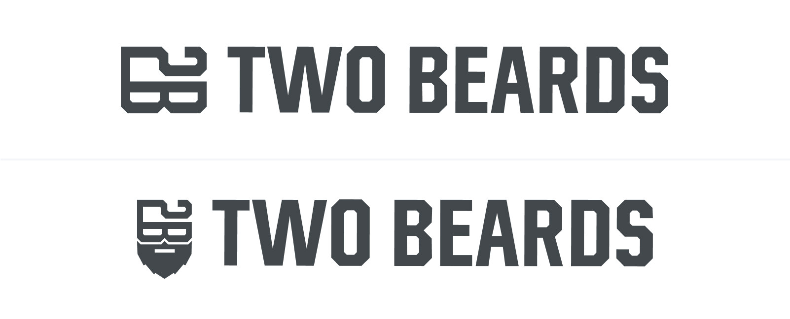

My buddy [Mike McBride](https://mikemcbride.dev) and I really enjoy working together, so we made a little side gig. Naturally, there are two of us and we both have beards, so we landed on [Two Beards](https://twobeards.dev). Right now, we've got a few [development helper](https://flexbox.tech/) [apps](https://box-shadow.dev/) out there, and we're working on some more.

We have a few ideas for some products that we'll hopefully be launching in the next year or so... Between our two families, we have a lot of *young* kids so our timeline keeps getting extended. That doesn't me we aren't excited.

We are also open to doing freelance work, but it really had to be something we believe in. Our time is extremely valuable. That said, we can do everything from design to development. You want design, we can do that. You need development, we can do that. You want to order us a pizza, we can eat that. We are here to serve you.

## Finding Two Beards
We're working on a [website](https://twobeards.dev) now to have a landing page for all of our work. More coming soon.

## Alternate Logo Versions

