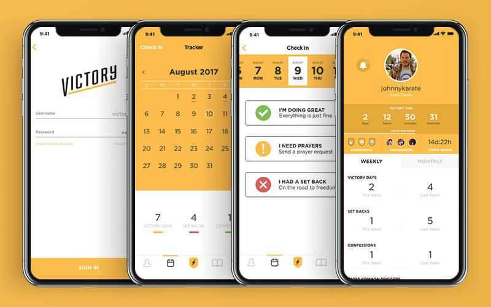

The Victory App was created to help people find freedom from addiction to pornography. Unfortunately, the app is not available anymore, and when you try to visit thevictoryapp.com, you get redirected to [Covenant Eyes](https://www.covenanteyes.com/).

The Victory App version 1 helped a lot of people, but the app felt clunky and outdated. Version 2 was completely reimagined from the ground up. It has a much cleaner and more user-friendly UI, with many new features and customizations. I'm proud of the way the app turned out, and I know it helped a lot of people find freedom.

## My Contributions:
The development of this app was primarily outsourced, because of time constraints. I spearheaded the rest of the app, from concept to wireframing to design and prototyping using Adobe XD and Photoshop. I helped with the branding of this second version of the app and design language.
